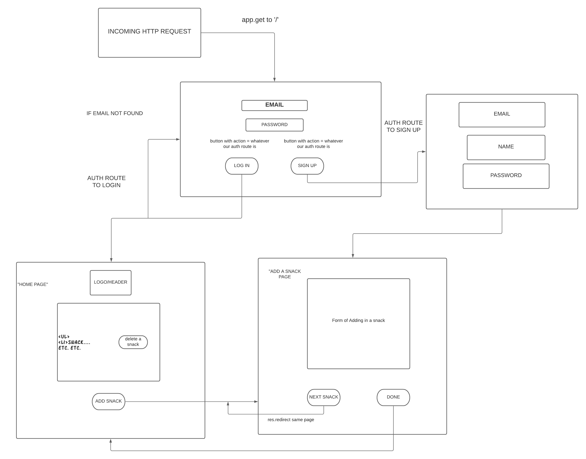
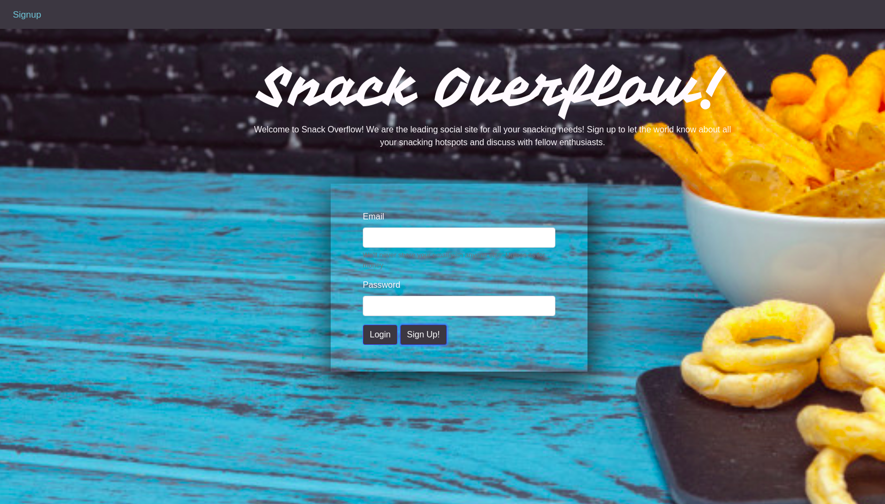
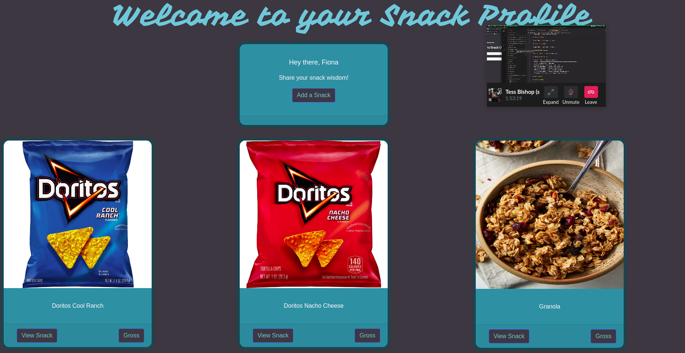
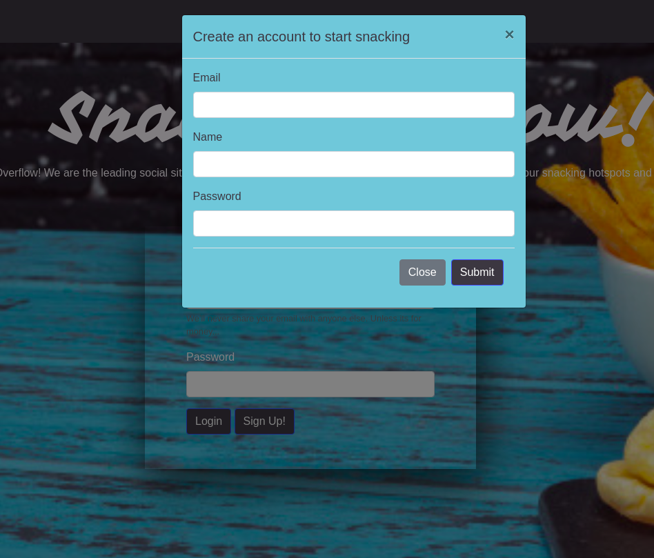
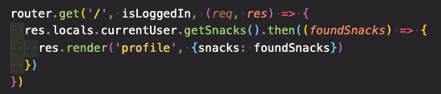

# Snack Overflow
Welcome to Snack Overflow! We are the leading social site for all your snacking needs! Sign up to let the world know about all your snacking hotspots and discuss with fellow enthusiasts.

## About 

Snack Overflow is a fullsnack application design for snack enthusiasts. The goal of our app is to allow users to log in and create an account to view their favorite snacks and photos and details to their profile.

## User Stories
As a user, I would like to be able to create a profile full of my favorite snacks.
As a user, I would like to be able to add new snacks, delete old snacks, and leave comments

## Languages Written In
Node
HTML5
CSS3
Bootstrap

### User DB Model

| Column Name | Data Type | Notes |
| --------------- | ------------- | ------------------------------ |
| id | Integer | Serial Primary Key, Auto-generated |
| name | String | Must be provided |
| email | String | Must be unique / used for login |
| password | String | Stored as a hash |
| createdAt | Date | Auto-generated |
| updatedAt | Date | Auto-generated |

### Snack DB Model

Column Name | Data Type | Notes |
|---------------------|-------------------|--------------------------|
| id  | Integer | Serial Primary Key, Auto-generated |
| Name | String | Must be provided, user input |
| Description | String | Must be provided, user input |
| imgUrl | String | Must be provided, we recommend imgur! |
| createdAt | Date | Auto-generated |
| updatedAt | Date | Auto-generated |

### Join Table Model

Column Name | Data Type | Notes |
| ---------------- | ------------- | -------------- |
| userId | Integer | Pulled from User DB |
| snackId | Integer | Pulled from Snack DB |

### Comment Table Model 

Column Name | Data Type | Notes |
|------------------ | ----------------- | -------------------|
| userId | Integer | Pulled from user DB |
| snackId | Integer | Pulled from snack DB |
| comment | Text | Must be provided, user input |

### Wire Frames

### Site Images

### Code Captures
Mario 

Tess

Martin

### Contributor Githubs

https://github.com/tbisho/
https://github.com/mgcarbonell
https://github.com/martinacruz

### About Us

We are three budding fullstack developers attending General Assembly's Software Engineering Immersive Remote class.  

### Future Developments

Edit Route
API 

### Credits

* Jacob for giving us the golden ratio 
* James for fixing the golden ratio
* Seanny for assisting with github workflow
* Michael for simplifying out create route
* All of the GA TA's during office hours 
